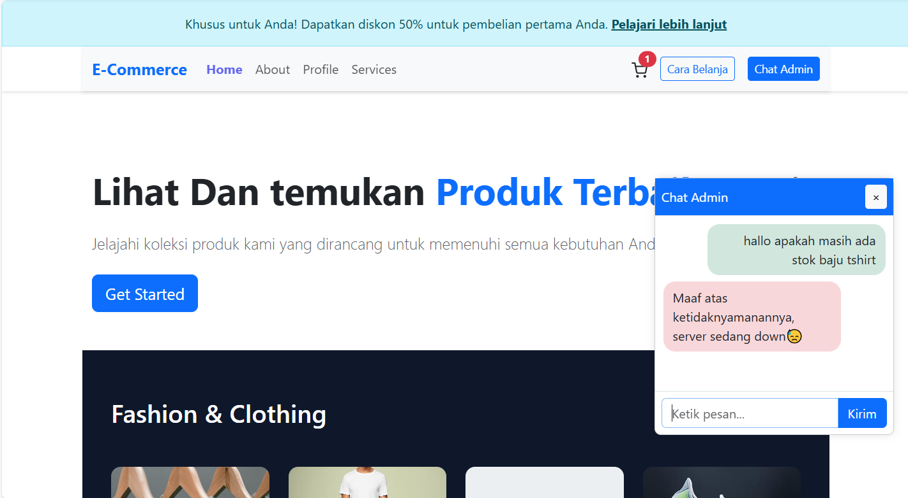

# Halo Guys Ini adalah tugas kulih Kita Kelompok 1 di matakuliah Pemrograman Web 🙌

### jadi projek ini adalah web E-Commers dengan integrasi ke database lokal yang pastinya sudah konsum API ya

### Berikut ini link  presentasi projek kami kelompok 1

### Apa Saja Yang Di gunakan Di Projek ini?

## Database

## Bahasa

### 🎥 Demo Aplikasi

  
  

